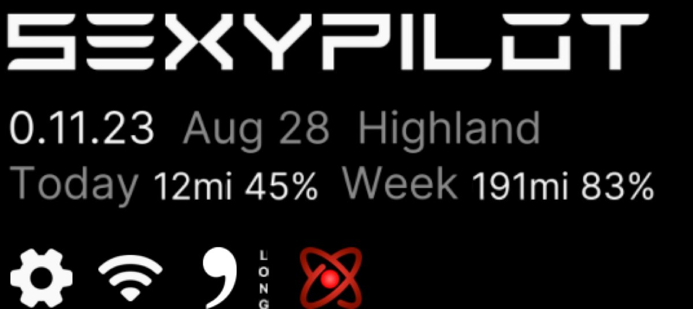
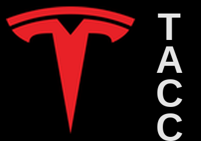
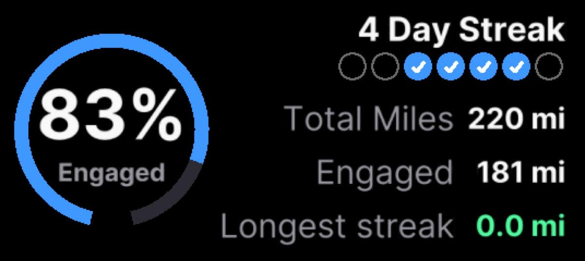
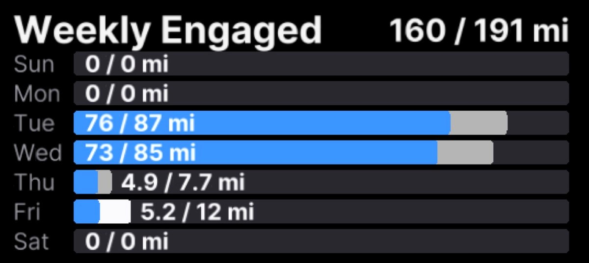
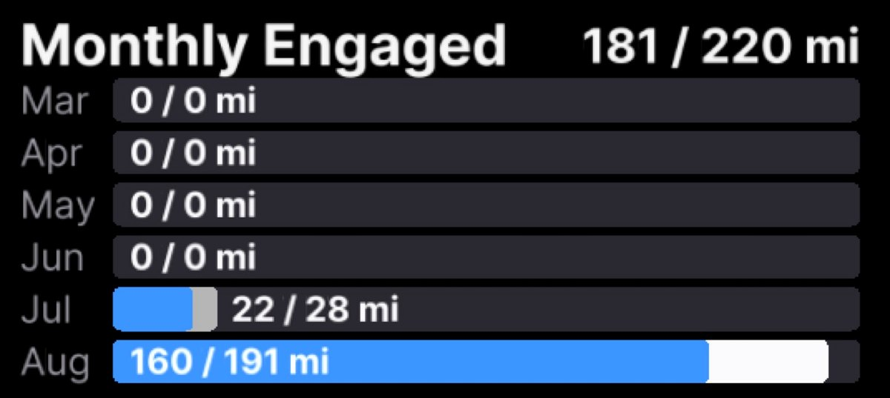

# S3XYPilot

Tesla-first fork. Stalkless Model 3 / Y. Hobby project. No support. Install at your own risk.

Driven on a **2026 Model 3 Highland**. Based on openpilot 0.11.2. This branch versions as **0.11.23**.

Installer: [`installer.comma.ai/Memberoffoxhound/Highland`](https://installer.comma.ai/Memberoffoxhound/Highland)

## Branches

- **`master`** — unmodified [comma.ai/openpilot](https://github.com/commaai/openpilot) mirror.
- **`Highland`** — S3XYPilot. Install this.

## Highland

Stalkless Teslas have no cruise stalk. Engage / disengage is the **right scroll-wheel button**. Cooperative steering stays on.

You are the driver. This fork does not change driver monitoring, actuation checks, or panda safety. See [SAFETY.md](SAFETY.md).

comma 4 UI. comma 3X may boot; UI is not tailored to it.

### Onroad

Theme → onroad UI is **stock** or **custom**. Custom paints Tesla Autopilot-blue lanes, wheel, confidence, compass, and DM. Theme → Tesla or Openpilot. Compass is small-left or large top-right.

Stock HUD is one tap away.

- Auto Lane Change — off by default; Tesla stock BSM; warning + confirm; 25 mph min.
- Cooperative steering — on.
- Scroll-wheel disengage — stalkless cancel.

### Home

Home is the parked comma 4. Version, date, and branch sit under the wordmark. Under that: **engagement stats**.



**Today** and **Week** are distance and percent of that distance spent engaged. Today resets at Chicago midnight. Week resets Sunday. Totals survive reboot and update. Tap the row to open statistics.

The footer shows which longitudinal stack is live:

| | |
|:---:|:---|
|  | **TACC** — Tesla Traffic-Aware Cruise Control. Openpilot steers. Tesla still does gas and brake. |
|  | **LONG** — openpilot longitudinal. Alpha. Openpilot does gas and brake, not Tesla ACC. |
|  | **Experimental** — the atom. Tap to toggle when LONG is on. Hidden on TACC; Tesla is already the longitudinal stack. |

Speaking of statistics…

### Statistics

Inspired by Tesla’s Self-Driving stats, miniaturized for the comma 4. Work in progress. Yes, it’s a 536×240 windshield display. Small, but interesting.

Open it from the Home stats row, or Settings → **statistics** (the wheel).

Three snap pages. Accents follow Theme (Tesla blue / Openpilot green).

**Engaged** — lifetime ring, day-streak checks, total miles, engaged miles, longest stretch.



**Weekly Engaged** — each day is engaged miles out of that day’s total.



**Monthly Engaged** — same idea, by month. Lifetime totals stay after old qlogs are deleted.



### Theme

Theme extras, **off by default**: Delorean 88mph clip (on going onroad, after ignition settles).

### Device web UI

Hold the display 3s for a screenshot (`/data/media/0/screenshots`).

On the LAN: `http://<comma-ip>:8088`. Statistics, vSlam tracker, screenshots, and **Live cameras** (WebRTC fcam/ecam/dcam + Tesla overlay). No auth — local network only.

### vSlam

Tesla can dump cruise set speed by 6 mph or more with no curve in front of you. On **TACC**, Tesla still owns gas and brake, so that slam is Tesla's problem. On **OP long**, the slammed set speed becomes openpilot's cruise target and the car follows it down — which is how stock phantom braking overrides the openpilot longitudinal planner.

#### Settings tree

```
Settings
└── vSlam Settings
    ├── vSlam logger   (observe-only; default on)
    ├── vSlam filter   (behavioral; OP long only; locked on TACC)
    ├── event list
    └── 60s trace
```

LAN deviceweb (`http://<comma-ip>:8088` → vSlam) mirrors the same two toggles.

#### What each control does

**vSlam Logger** — Observe-only. When Tesla drops cruise set speed by ≥6 mph, the logger records the slam (pre/slam mph, path class, recover timing) for the C4 list, 60s trace, and LAN deviceweb. It never changes gas, brake, or openpilot's longitudinal target. Leave it on if you want a paper trail of phantom brakes; turn it off to stop writing `/data/vslam` events.

**vSlam Filter** — Active counter for stock Tesla phantom braking when **openpilot long** owns the policy. On a straight-road slam (≥6 mph set-speed dump with no curve/ramp/blinker path), Tesla's ACC can chase the slammed cruise target and yank the car down even though openpilot's planner didn't ask for it. After a short window, if set speed starts rising again the filter treats it as a glitch and ignores the dump; if it stays slammed, openpilot honors the new set speed. Locked off while **TACC** is the long policy (Tesla already owns pedals). Does not invent slowdowns in corners or on ramps.

#### Filter rule tree

```
vCruise drop >= 6 mph
|
|-- logger off ------------------------------------------ not logged
|
|-- path = cornering / ramp / blinker curve
|     HONOR immediately
|     openpilot long is not ready to invent that slowdown
|
|-- path = unknown (thin GPS / mixed votes)
|     HOLD (treat as honor until more path exists)
|
`-- path = straight  (this is the filter)
      |
      |-- driver adjusting speed (gas / stalk) ---------- DRIVER
      |     leave the set-speed change alone
      |
      |-- set speed starts rising >= 1 mph within 6 s --- IGNORE
      |     Tesla glitch. Do not follow the slam down.
      |
      `-- still sitting at the slammed set speed at 6 s - HONOR
            follow set speed down
```

## Tesla compatibility

Same Tesla platforms as stock comma. **2026 Model 3 Highland is not on comma’s list yet; this fork is driven on one and it works.**

| Car | Years | Notes |
|---|---|---|
| Model 3 HW3 | 2019–23 | [comma official](https://docs.comma.ai/CARS/) |
| Model 3 HW4 | 2024–26 | official through 2025; **2026 Highland confirmed on this fork** |
| Model Y HW3 | 2020–23 | comma official |
| Model Y HW4 | 2024–25 | comma official |

HW3 uses Tesla A harness, HW4 uses Tesla B. Alpha longitudinal is TACC vs openpilot gas/brake.

S / X / Cybertruck are not supported. 2026 Model Y is untested here.

## Install

```
installer.comma.ai/Memberoffoxhound/Highland
```

Username `Memberoffoxhound`, branch `Highland`. Repo is named `openpilot` so that installer URL works.

Stock install: [`openpilot.comma.ai`](https://openpilot.comma.ai)

## Special thanks

These are not original to this fork. Huge thanks.

- **Automatic Lane Change** — based on [rav4kumar](https://github.com/rav4kumar)'s implementation of Automatic Lane Change in sunnypilot ([#653](https://github.com/sunnypilot/sunnypilot/pull/653)), with [Jason Wen / sunnyhaibin](https://github.com/sunnyhaibin).
- **Cooperative steering** — based on [dzid26](https://github.com/dzid26)'s implementation of cooperative steering (virtual torque blending, `vtb` / `vtb-sla`). [AmyJeanes](https://github.com/AmyJeanes) landed Tesla Coop Steering in sunnypilot using native LKAS ([opendbc #287](https://github.com/sunnypilot/opendbc/pull/287)).
- **Stalkless scroll-wheel disengage** — based on [dkiiv](https://github.com/dkiiv)'s implementation of stalkless cancel (`DAS_accState == 13` → `ButtonType.cancel`, [opendbc #3203](https://github.com/commaai/opendbc/pull/3203)). Pulled from [dzid26](https://github.com/dzid26)'s Tesla fork.
